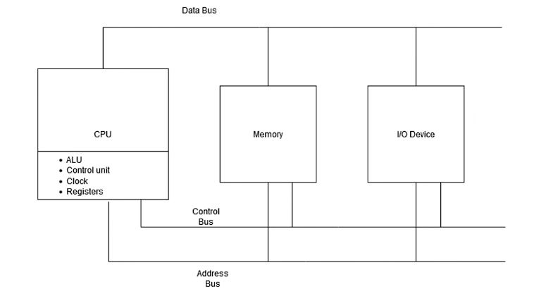

# **Assembly Language Notes**

## Introduction

#### Block Diagram of a Computer System Architecture

##### 1. CPU (Central Processing Unit)

This is the brain of the computer. It consists of:

1. ALU - Arithmetic and Logic operations
2. Control Unit (CU) - Directs the operation of the processor and coordinates data flow
3. Clock - Synchronizes operations within the CPU
4. Registers - Small, high-speed storage units inside the CPU for immediate data access

##### 2. Memory (RAM)

The main memory stores:

* Program instructions
* Input data
* Intermediate results
* Final outputs during execution

##### I/O Device

Consists of input devices (keyboard, mouse), output devices (monitor, printer), and Storage devices (hard disk, USB drives)

##### System Busses:

They consist of Data bus, Address Bus, and Control Bus

###### A. Data Bus:

* Transfers actual data between CPU, memory, and I/O devices.
* This bus is bi-directional, allowing data to move in both directions.

###### B. Address Bus

* Transfers memory addresses from the CPU to memory or I/O devices.
* It specifies the location where data should be read from or written to.
* This bus is typically unidirectional (from CPU outward).

###### C. Control Bus

* Transfers control and timing signals required for coordination.
* Examples include:
  * Read and write signals
  * Interrupt requests
  * Clock signals

---

## Instruction Execution Cycle (Fetch–Decode–Execute)

Every instruction executed by the CPU follows a standard sequence known as the **instruction cycle**.

##### Step 1: Fetch

The CPU retrieves the instruction from memory via the address bus and data bus.

##### Step 2: Decode

The control unit interprets the instruction and determines the required operation.

##### Step 3: Execute

The instruction is executed by the ALU or other processing units.

##### Step 4: Store

The result is stored back into memory or sent to an output device.

##### Overall

The CPU communicates with memory and I/O devices using these busses to:

* Fetch instructions from memory
* Decode them in the CU
* Execute them using ALU
* Stores result back into memory or sends them to output devices

---

## Memory Read Operation

Accessing data from main memory is slower than accessing CPU registers. A memory read operation is performed through the following steps:

1. The CPU places the target memory address on the address bus.
2. The processor asserts the **Read (RD)** control signal.
3. The CPU waits for one clock cycle for memory to respond.
4. The requested data is transferred from the data bus to the destination register.

Each step typically consumes approximately one clock cycle. In comparison, register access usually requires only a single clock cycle.

---

## Cache Memory (Caching)

To improve memory access speed, cache memory is used to store frequently accessed data closer to the CPU.

##### Cache Characteristics:

- Reduces read/write time for memory access.
- Improves overall system performance.

##### Cache Organization (x86 Architecture):

- **Level 1 (L1) Cache:** Located inside the CPU.
- **Level 2 (L2) Cache:** Located outside the CPU and accessed via a high-speed data bus.

##### Cache Technology:

Cache memory is implemented using **Static RAM (SRAM)**, which does not require periodic refreshing and offers faster access compared to Dynamic RAM (DRAM).

---
